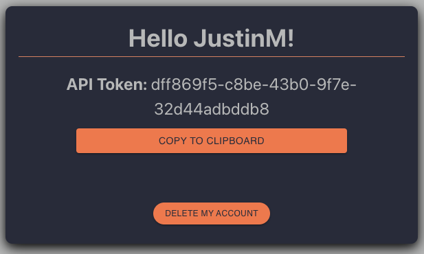
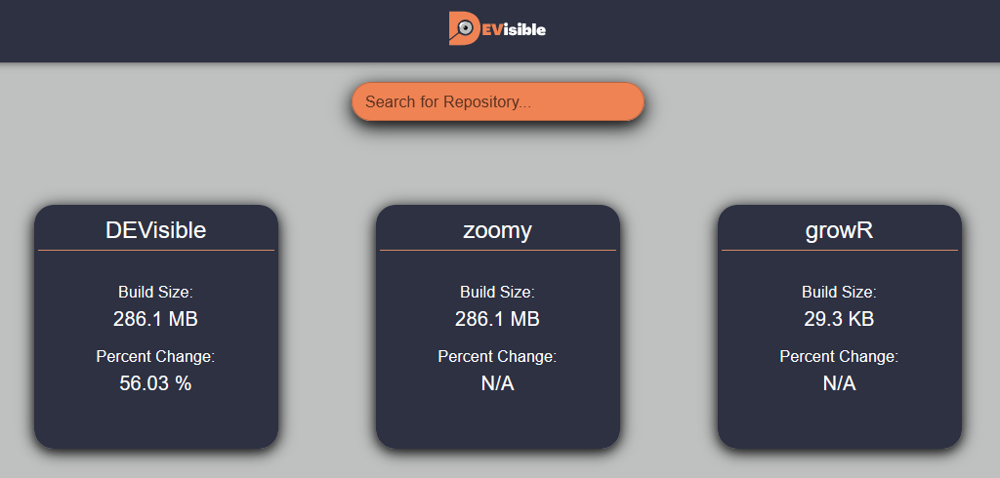

# DEVisble

## Description

DEVisible is a tool for monitoring metadata related to your Github repositories. DEVisible was designed with engineering managers and DevOps teams in mind with the goal of improving efficiency by aggregating and visualizing relevant repository information. DEVisible was designed to be used in tandem with the public [DEVisible Website](https://devisible.app), but as an Open Source project, you can also run a self-hosted web app. Simply clone this repository and modify the code as you see fit.

## Web Component

#### In order to tap into the full potential of DEVisible you must register on the [Web App](https://devisible.app) in order to receive an API Key.

1. Navigate to [www.devisible.app/signup](https://devisible.app/signup) using your device/browser of choice
2. Enter the required information and click register
3. You will be automatically be logged in and redirected to the dashboard -- click on the hamburger icon in the top right corner of your screen
4. Click 'Account' on the drop-down menu that appears
5. Click 'Reveal API Token'



6. This API key will be used in conjunction with the NPM package (next section)

Alternatively, you may clone the DEVisible repository from our GitHub to run the app locally and customize it to your needs.

#### Dashboard will be dynamically updated as new repos and builds are added using the NPM package



## NPM Package

#### The NPM Package is the primary driver of DEVisible's functionality. The NPM package can be used as part of a CI/CD pipeline or locally from the terminal. Metadata collected by the package will be sent to the Web application, where account and repo build information can be viewed.

#### Installation steps

1. Install the `devisible` package from the NPM Registry. This can be done via either:  

* Local Install:
`npm install devisible`

* Global Install:
`npm install -g devisible`

2. DEVisible assumes it is being called from the git root and project root, but allows escape hatches if either of those conditions are not the case. Run `npx devisible -h` to see help for how to pass this info.

#### If Using Package From Terminal

1. Pass your project's build command into the DEVisible command line parameter, along with your API key and the path of the build output. **Note:** this will not necessarily reflect the data at the time of pushing to Github, since DEVisible is not being invoked at the time of pushing.

* Local Install:
`node ./node_modules/devisible --apiKey api_key_goes_here --buildPath dist/ --command "npm run build"`

* Global Install:
`npx devisible --apiKey api_key_goes_here --buildPath dist/ --command "npm run build"`

2. Navigate to the [Web App](www.devisible.app) and log in to view your updated repo information!

#### If Using Package in CI/CD Pipeline

1. Add your API key as a [GitHub Secret](https://docs.github.com/en/actions/security-guides/encrypted-secrets). This can be scoped to the account level, or you can add it to specific repos in which you wish to use DEVisible.

2. Create a `.github/workflows` directory in your project's root directory. If you already have CI/CD functionality you can skip this step.

3. Create a new `.yml` file in `.github/workflows`.

4. Invoke DEVisible during your build step. This is an example YAML configuration that will run DEVisible on every push through GitHub Actions.

```jobs:
on: push
jobs:
  build:
    runs-on: ubuntu-latest
    steps:
      - name: Checkout Repo
        uses: actions/checkout@v3
      - name: Setup Node
        uses: actions/setup-node@v3
      - name: Install dependencies
        run: npm ci
      - name: Install DEVisible package
        run: npm i -g devisible
      - name: Run DEVisible NPM package
        env:
          API_KEY: ${{ secrets.devisibleKey }}
        run: |
          npx devisible --apiKey "$API_KEY" --buildPath client/dist --command "npm run build"
```

5. Perform the action that will trigger the workflow that invokes DEVisible (e.g., push, merge)

6. Navigate to the [Web App](www.devisible.app) and log in to view your updated repo information!
